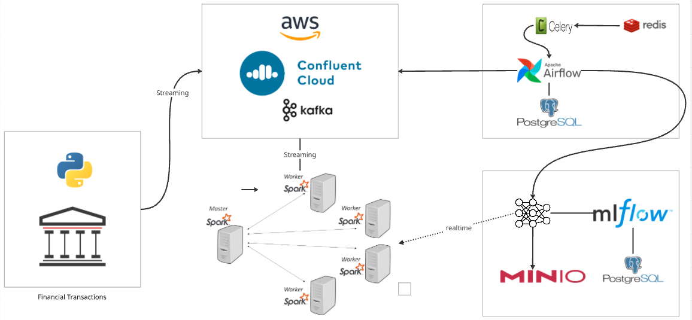

# Real-Time AI Financial Fraud Detection System (end to end deployment)

A production-grade fraud detection platform that combines streaming data processing, machine learning, and MLOps workflows to identify fraudulent financial transactions in real-time using Apache Airflow, MLflow, and XGBoost.



## System Architecture

### **Data Pipeline**
- **Transaction Producer**: Kafka-based producer generating realistic financial transactions with configurable fraud patterns
- **Stream Processing**: Confluent Kafka with SASL/SSL authentication for secure data ingestion
- **ML Training**: XGBoost classifier with automated hyperparameter tuning and class imbalance handling
- **Model Registry**: MLflow integration with S3-compatible artifact storage (MinIO)
- **Orchestration**: Apache Airflow DAG for daily automated model retraining

### **Technology Stack**
| Component | Technology | Purpose |
|-----------|------------|---------|
| **Stream Processing** | Confluent Kafka | Real-time transaction ingestion with SASL/SSL |
| **ML Framework** | XGBoost + scikit-learn | Fraud classification with SMOTE balancing |
| **MLOps Platform** | MLflow | Experiment tracking & model registry |
| **Workflow Engine** | Apache Airflow | Daily training pipeline orchestration |
| **Feature Engineering** | pandas + numpy | Temporal, behavioral & monetary features |
| **Object Storage** | MinIO (S3-compatible) | Model artifacts and experiment data |
| **Authentication** | SASL/SSL + AWS credentials | Secure data access and storage |

## Key Features

### **Advanced Fraud Pattern Detection**
- **Account Takeover**: Monitors compromised users (0.5% of user base) with high-value transactions (>$500)
- **Card Testing**: Detects rapid small-amount transactions (<$2.00) with 25% fraud probability
- **Merchant Collusion**: Identifies suspicious activity with predefined high-risk merchants
- **Geographic Anomalies**: Flags transactions from high-risk countries (CN, RU, NG)

### **Production-Grade Data Generation**
- **Realistic Simulation**: 10,000 synthetic users with 1-2% fraud rate across multiple attack vectors
- **Pattern Distribution**: Account takeover (40%), card testing (30%), merchant collusion (20%), geo anomaly (10%)
- **Schema Validation**: JSON schema enforcement with date-time format checking
- **Temporal Variation**: Transaction timestamps with ±5 minute randomization for realism

### **Machine Learning Pipeline**
- **Feature Engineering**: 
  - Temporal features (night/weekend indicators, transaction hour)
  - Behavioral features (24-hour user activity windows)
  - Monetary features (amount-to-average ratios)
  - Merchant risk profiling
- **Class Imbalance Handling**: SMOTE (Synthetic Minority Oversampling Technique)
- **Hyperparameter Optimization**: RandomizedSearchCV with stratified K-fold cross-validation
- **Threshold Tuning**: Dynamic threshold optimization using precision-recall curves
- **Model Evaluation**: F-beta score (β=2) emphasizing recall for fraud detection

### **MLOps & Observability**
- **Experiment Tracking**: Automated metrics logging with MLflow (AUC-PR, precision, recall, F1-score)
- **Model Registry**: Version control and artifact management with model signatures
- **Visualization**: Confusion matrix and precision-recall curve generation
- **Artifact Storage**: Model serialization with joblib and MLflow sklearn integration
- **Data Quality Monitoring**: Fraud rate tracking and schema validation guards

### **Enterprise Features**
- **Security**: SASL/SSL Kafka authentication with credential isolation
- **Configuration Management**: Environment-agnostic YAML configuration with secret management
- **Error Handling**: Comprehensive exception handling with structured logging
- **Graceful Shutdown**: Signal handling for clean service termination
- **Resource Management**: Configurable memory caching and consumer timeout handling
- **Health Checks**: MinIO connectivity validation and environment pre-flight checks

### **Operational Capabilities**
- **Automated Workflows**: Daily model retraining via Airflow DAG with task dependencies
- **Scalable Architecture**: Consumer timeout management and horizontal scaling support
- **Audit Logging**: Structured logging across all components with file and stdout handlers
- **Deployment Ready**: Model packaging for production deployment with artifact management
- **Environment Validation**: Pre-flight system checks and dependency verification

## How to Use

### Prerequisites
- Docker installed
- Kafka cluster (Confluent Cloud) credentials
- At least 8GB RAM available

###  Environment Setup
Clone the repository and configure your environment variables.

Edit the `.env` file with your credentials:

  KAFKA_BOOTSTRAP_SERVERS=your-kafka-cluster-url:9092\
  KAFKA_USERNAME=your-kafka-api-key\
  KAFKA_PASSWORD=your-kafka-api-secret\
  KAFKA_TOPIC=transactions

  MinIO (S3-compatible) Credentials for MLflow\
  AWS_ACCESS_KEY_ID=minioadmin\
  AWS_SECRET_ACCESS_KEY=minioadmin


  AWS_ACCESS_KEY_ID=minio\
  AWS_SECRET_ACCESS_KEY=minio123\
  AIRFLOW_UID=100\

Run Docker command :  <pre> ``` docker compose --profile flower up -d --build ``` </pre>
